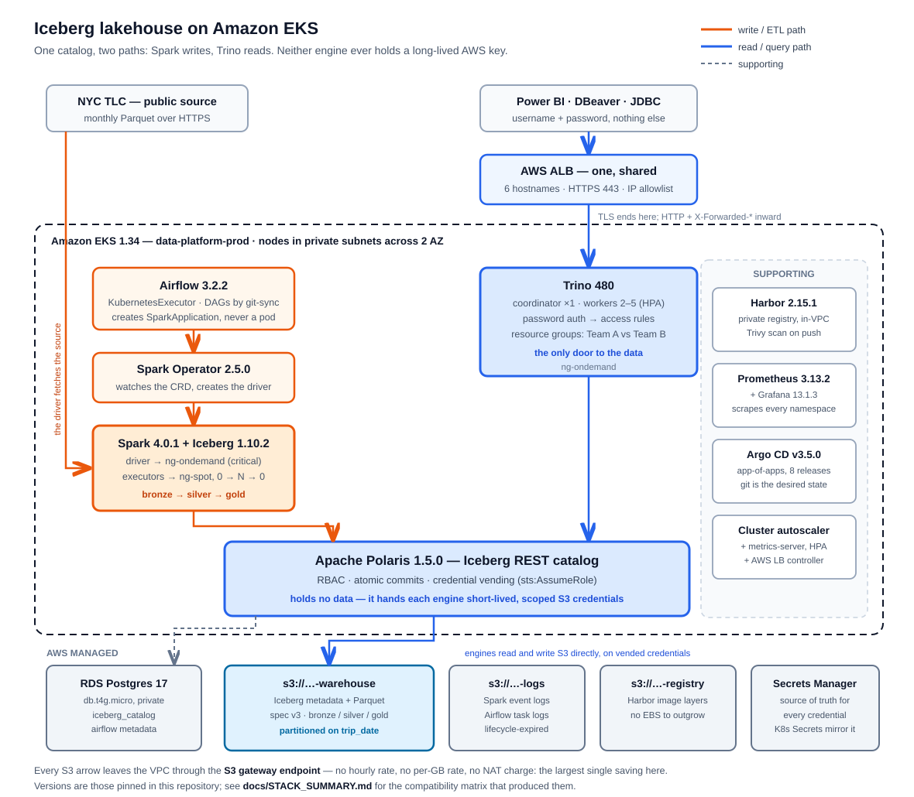

# System architecture

> *"System architecture diagram, including reasons for choosing this
> architecture and cost awareness justification."* — Deliverable 1



Two editable companion views live in
[`diagrams/eks-infrastructure.drawio`](diagrams/eks-infrastructure.drawio)
(open in draw.io): page 1 **EKS Infrastructure** — the AWS layer with VPC,
subnets, node groups and managed services; page 2 **Data Platform** — the
Kubernetes layer grouped by namespace, with the write and read paths meeting
at Polaris.

## The shape, in one paragraph

Storage is S3 and nothing else writes to it directly. **Apache Polaris** is the
only thing that knows where a table's current metadata lives, and it is also
the only thing that can hand out credentials for the bucket — so every engine
has to go through it, and access control has exactly one place to live. Spark
writes through it, Trino reads through it. Both run on the same EKS cluster,
sized so that the part that must not be interrupted is on On-Demand and the
part that can be restarted is on Spot. Everything a user touches arrives
through one ALB with one certificate.

Two paths, and they never meet except at the catalog:

| | Write | Read |
|---|---|---|
| Trigger | Airflow, 10:00 daily | a user or a dashboard |
| Engine | Spark 4.0.1 | Trino 480 |
| Runs on | driver On-Demand, executors Spot 0→N→0 | On-Demand, 2–5 workers via HPA |
| Talks to | Polaris | Polaris |
| Sees S3? | on vended, short-lived credentials | on vended, short-lived credentials |

Versions and the compatibility matrix that produced them are in
`STACK_SUMMARY.md`. This document is about the shape and the reasons.

---

## Why this architecture

Ordered by how much each decision constrains everything downstream.

### 1. Iceberg, and therefore separated storage and compute

Iceberg is the brief's one mandatory constraint, but it is also what makes the
rest of the design possible. Because a table is a set of Parquet files plus a
metadata pointer in a catalog, **compute is disposable**. Trino can be scaled
to zero workers overnight, the Spot group can hold no nodes at all between
runs, and the data is unaffected because no engine owns it.

A warehouse where storage and compute are the same process — anything of the
Redshift or self-managed-Postgres shape — cannot do that. You pay for the
machine that holds the data whether or not anyone is querying, and at terabyte
scale that is the whole bill.

What Iceberg adds on top: ACID commits so a failed Spark job leaves no partial
table, hidden partitioning so `WHERE trip_date = ...` prunes files without the
query author knowing the layout, schema evolution without rewriting, and time
travel — which is what makes "restore yesterday's version" a query rather than
a restore.

### 2. Apache Polaris as the catalog, not Glue

The catalog is the one component every engine must talk to, so it is where
governance either exists or does not.

| Option | Why not |
|---|---|
| **AWS Glue Data Catalog** | least to operate, and rejected on purpose. The point of Iceberg-plus-a-REST-catalog is that the tables stay readable by any engine on any cloud; pinning the catalog to a proprietary AWS service gives that portability back on day one. |
| `tabulario/iceberg-rest` | the image most tutorials use. No RBAC, no credential vending, no release process — a demo, not a control plane. |
| Nessie | git-like branching across tables. Genuinely useful, for a problem this platform does not have. |
| Lakekeeper | credible and lighter, with a much smaller ecosystem behind it. |
| **Apache Polaris 1.5.0** | chosen. Apache top-level project, full REST spec, and the two things that matter here in the box: **RBAC** and **credential vending**. |

**Credential vending is the load-bearing feature.** Polaris holds no S3
permission on its own pod identity. It assumes a storage role and returns
short-lived credentials scoped to the prefix of the table being accessed:

```
pod (ServiceAccount)
  → IRSA role                (EKS OIDC federation, no static key)
  → sts:AssumeRole (+ ExternalId)
  → polaris-storage-role     (S3, scoped to the warehouse prefix)
  → temporary credentials, per request, per table
```

The consequence worth stating plainly: **there is no long-lived AWS key
anywhere in this cluster for table data.** A compromised Spark pod holds a
credential that expires, for one prefix. Detail and the request flow:
`diagrams/polaris_request_flow.svg`.

### 3. Trino as the query engine — and as the only door

The brief leaves the engine open. Trino was chosen for the most mature Iceberg
read/write connector, standard JDBC/ODBC so BI tools connect with no adapter,
and — the reason it earns its cost — **multi-tenant workload isolation via
resource groups**.

The alternatives were considered and rejected for reasons specific to this
workload:

- **Athena** — serverless and cheap at low volume, but per-TB-scanned pricing
  is unpredictable exactly when a team sends 100 queries at once, and it offers
  no way to stop one team's burst starving another's.
- **DuckDB** — excellent, and single-process. Each analyst would need their own
  copy of the data or their own AWS credentials, which is the model this design
  exists to avoid.
- **Spark SQL as the serving layer** — it is already here, and its query
  latency is wrong for a dashboard slicer.

**Everything a user does goes through Trino, and that is a security decision as
much as a query decision.** Authentication, authorisation, resource limits and
audit all sit at one choke point. A BI client holds a Trino username and
password and no AWS credential at all; it cannot reach the warehouse bucket
even if it tries.

### 4. How the brief's two workloads are actually served

> *"Team A might execute queries for reports every day at 10 a.m., while Team B
> might need to execute queries to monitor sales performance every hour…
> assume that 100 queries will be sent every time."*

Three mechanisms, and they solve different halves of it:

| Mechanism | Solves |
|---|---|
| **Resource groups** (`weighted_fair`) | Team A's 100-query burst cannot starve Team B's hourly checks. Concurrency and memory are capped per group, so the burst queues rather than consuming the cluster. |
| **Worker HPA**, 2 → 5 on CPU > 50% or memory > 80% | the burst finishes sooner instead of merely being fair about being slow. |
| **Gold tables shaped for Import mode** | the 100 queries largely never arrive. A pre-aggregated, pre-joined day is a few hundred rows, so Power BI imports it and answers slicer clicks from memory. |

The third is the one that scales. Isolation and autoscaling handle load; **not
generating the load is better than handling it**, and that is a data-modelling
decision rather than an infrastructure one. `DATA_MODEL.md`.

### 5. Kubernetes for all of it

Bonus 1 asks for it, but there is an independent reason: the four workloads
here have genuinely different lifecycles — a long-lived query engine, a
scheduler, batch jobs that exist for four minutes, and a registry. Kubernetes
is the one substrate that runs all four, gives them one identity model (IRSA),
one metrics pipeline, one deployment mechanism (Argo CD), and one autoscaler.

The alternative — EMR for Spark, MWAA for Airflow, ECS for Trino — is four
services, four IAM models, four monitoring stories and four bills.

**Concretely, EKS is what makes the Spot economics work.** The Cluster
Autoscaler brings `ng-spot` up from zero when a Spark executor cannot be
scheduled and takes it back down five minutes after the job ends. Spot's 60–70%
discount only helps if the capacity also disappears when idle. `AUTOSCALING.md`

### 6. Managed services where the state is irreplaceable

- **RDS over self-hosted Postgres** — the catalog database is the one piece of
  state that cannot be recomputed. Lose it and every table is a pile of Parquet
  nobody can name. Automated backup and PITR for ~\$15/month is not a close
  call.
- **S3 over MinIO** — cheaper per GB than EBS at scale, effectively unlimited,
  zero ops. The brief says terabyte scale.
- **Secrets Manager as the source of truth**, Kubernetes `Secret` as a mirror
  written by scripts. Every credential is generated by `openssl rand`, stored,
  and from then on only moves machine-to-machine. `IDENTITY_AND_SECRETS.md`

---

## Cost awareness

Full working in `COST.md`. The summary:

| Item | Monthly |
|---|---|
| EKS control plane | ~\$73 |
| `ng-ondemand` 5 × m5.large | ~\$425 |
| `ng-spot` 0 → N | ~\$0 idle |
| RDS `db.t4g.micro` | ~\$15 |
| ALB (one, shared, 6 hostnames) | ~\$22 |
| NAT gateway (one) | ~\$32 |
| S3 | a few \$ |
| **S3 gateway endpoint** | **\$0 — and the largest saving here** |

Four decisions carry most of it:

1. **S3 gateway VPC endpoint.** NAT charges ~\$0.045/GB of *data processing*.
   S3 is this platform's storage layer, so a single 1 TB Trino scan would cost
   about \$45 — billed under *NAT Gateway*, not under *S3*, which is where
   nobody looks. The endpoint has no hourly rate and no per-GB rate.
2. **`ng-spot` at zero.** Executors are the only workload on Spot and the group
   holds no nodes between runs, so the discount is real rather than
   aspirational.
3. **One ALB for six hostnames** via `group.name`. Six separate load balancers
   would be ~\$132/month instead of ~\$22.
4. **Nodes bought one at a time, each after a pod failed to schedule** — never
   in anticipation. The fifth was for the monitoring stack, and `COST.md` names
   what it bought.

**Compute is the visible half of the bill and rarely the surprising one** — you
chose the instance type, so you know what it costs. The charges worth designing
against are the ones that accrue in a service you were not deliberately using,
under a line item nobody checks. That is why the largest saving in this
architecture is a VPC endpoint rather than a smaller node.

---

## What this architecture deliberately does not have

Stated here rather than left to be discovered, because a design is also its
omissions:

| Missing | Consequence | Why not now |
|---|---|---|
| **NetworkPolicy** | any pod can open a socket to any Service; a compromised Airflow task pod can reach Polaris directly, bypassing the ALB allowlist | the largest gap. Cheap to write, needs care because the real paths are not all obvious. `NETWORK-PLANE.md` |
| HA NAT (one per AZ) | a NAT failure takes outbound traffic with it | ~\$32/month per extra zone, for a platform whose outbound path is image pulls |
| Trino coordinator HA | a coordinator restart drops in-flight queries | a second coordinator is a different cluster, not more capacity |
| CI (GitHub Actions runners) | the Spark image is built and pushed by hand | Argo CD already closes the deploy half of the loop; the build half is on the roadmap |
| Long-term metrics (Mimir 3.1.2) | 7 days of history, so no capacity planning over months | a component in its own right, not a bigger EBS volume. Pinned as a planned upgrade with trigger conditions in `STACK_SUMMARY.md` |
| HashiCorp Vault | no dynamic credentials, no per-read audit inside the cluster | Vault run badly is less reliable than the three static secrets it guards. Trigger conditions in `STACK_SUMMARY.md` |
| Kafka → Flink → ClickHouse | no sub-second freshness | the brief asks for daily and hourly; this would add standing infrastructure that never scales to zero |

---

## Where each piece is documented

| Question | Document |
|---|---|
| What is installed, which version, and why that version | `STACK_SUMMARY.md` |
| How to build the whole thing from an empty account | `../script/` — numbered, in order |
| How the ETL runs, and how to run it | `HOW_TO_PERFORM_ETL.md` |
| What the tables contain and how a number traces back | `DATA_MODEL.md` |
| How a user connects | `HOW_USERS_CONNECT_AND_QUERY.md` |
| What it costs and why | `COST.md` |
| How traffic reaches it | `NETWORK-PLANE.md` |
| What scales, and what does not | `AUTOSCALING.md` |
| How it is monitored | `HOW_TO_MONITOR_THE_PLATFORM.md` |
| Who can do what | `SECURITY_GOVERNANCE.md`, `IDENTITY_AND_SECRETS.md` |
| Where data lives and for how long | `S3_DATA_TIER.md` (object), `EBS_AND_PERSISTENT_VOLUMES.md` (block) |
| What is built, what is not, and what to do next | `PROGRESS.md` |
